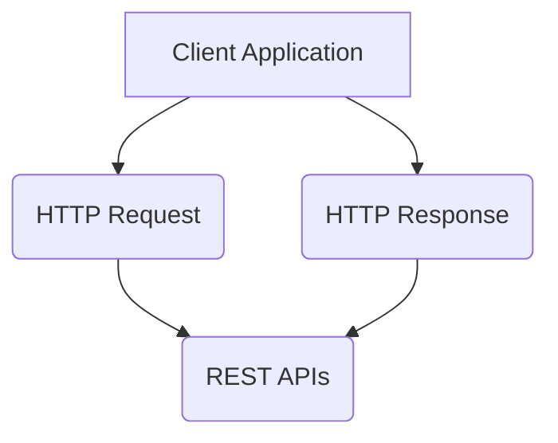

# 09.10.基本概念

## 1. 文档（Document）

**“文档”对应关系型数据库中ROW**

* * *
*  Elasticsearch事面向文档的，文档是所有可搜索数据的最小单位
    *  日志文件中的日志项目
    *  一本电源中的具体信息  一张唱片的详细信息
    *  MP3播放器里的一首歌  一篇PDF文档中的具体内容

* 文档会被序列化成JSON格式，保存在Elasticsearch中
    *  JSON对象由字段组成
    *  每个字段都有对应的字段类型 （字符串/数值/布尔/日期/二进制/范围类型）

*  每个文档都用一个Unique ID
    *  你可以自己指定ID
    *  或着通过Elasticsearch自动生成

## 2. JSON 文档 
* * *
* 一篇文档包含了一些列的字段。类似数据库表中一条记录
* JSON文档，格式灵活，不需要预先定义格式
    * 字段的类型可以指定或着通过Elasticsearch自动推算
    * 支持数组/支持嵌套

## 3. 文档的元数据

* 元数据，用于标注文档的相关信息
   - _index     --文档所属的索引名
   - _type      --文档所属的类型名
   - _id        --文档唯一 id
   - _source ： 文档的原始Json数据
   - _all  ：   整合所有字段内容到该字段，已被废除
   - _version:  文档的版本信息
   - _score：   相关性打分
    
## 4. 索引 

**"索引"对应关系数据库中的表**

* * *
* index --索引是文档的容器，是一类文档的结合
    * index 体现了逻辑空间的概念：每个索引都有自己的Mapping定义，用于定义包含的文档的字段名和字段类型
    * Shard体现物理空间的概念：索引中的数据分散在Shard上
* 索引的Mapping和Settings
    * Mapping 定义文档字段的类型
    * Setting 定义不同的数据分布

索引的不同语意

* 名词：一个Elasticsearch 集群中，可以创建很多不同的索引
* 动词：保存一个文档到Elasticsearch的过程也叫索引indexing
    * ES中，创建一个倒排索引的过程
* 名词：一个B树索引，一个倒排索引

## 5. Type(一些相同结构的文档)

* 在7.0之前，一个index可以设置多个Types
* 6.0开始，Type已经被废除，7.0开始，一个索引只能创建一个Type - "_doc"

抽象类别

| 关系型数据库|Elasticsearch  |
| --- | --- |
| table |index（Type）  |
| Row |Doucment  |
| Column |Field  |
| Schema |Mapping  |
| SQL |DSL  |

REST API --很容易被各种语言调用




**Index 相关 API**
```
    #查看**索引相关信息
    GET kibana_sample_data_ecommerce

    #查看索引的文档总数
    GET kibana_sample_data_ecommerce/_count

    #查看前10条文档，了解文档格式
    POST kibana_sample_data_ecommerce/_search
    {
    }

    #_cat indices API
    #查看indices
    GET /_cat/indices/kibana*?v&s=index

    #查看状态为绿的索引
    GET /_cat/indices?v&health=green

    #按照文档个数排序
    GET /_cat/indices?v&s=docs.count:desc

    #查看具体的字段
    GET /_cat/indices/kibana*?pri&v&h=health,index,pri,rep,docs.count,mt

    #How much memory is used per index?
    GET /_cat/indices?v&h=i,tm&s=tm:desc
```

[课件](https://github.com/geektime-geekbang/geektime-ELK/tree/master/part-1/3.1-%E5%9F%BA%E6%9C%AC%E6%A6%82%E5%BF%B51%E7%B4%A2%E5%BC%95%E6%96%87%E6%A1%A3%E5%92%8CRESTAPI)

## 6. 分布式系统的可用性与扩展性
- 高可用性
    - 服务可用性：允许有节点停止服务
    - 数据可用性：部分节点丢失，不会丢失数据
- 可扩展性
    - 请求量提升/数据的不断增长（将数据分布到所有节点上）
- 分布式特性
    - 存储的水平扩容
    - 提升系统的可用性，部分节点停止服务，这个集群的服务不受影响
   - 不同的集群通过不同的名字来区分，默认名字elasticsearch
    - 通过配置文件修改，或命令行指定 -E cluster.name=geektime
    - 一个集群可以有一个或多个节点
 - 节点
     - 节点是一个Elasticsearch实例，本质是一个java进程
     - 一台机器可以运行多个进程，生产环境一台机器只运行一个实例
     - 每个节点都有名字，通过配置文件配置，或命令行指定
     - 每个节点启动后，会分配一个UID，保存data目录下
 
 每个节点启动后，默认是一个Master eligible节点，可以设置node.master:false禁止

 Master-eligible节点可以参加选主流程，成为Master 节点
 当每一个节点启动时候，会将自己选举成Master节点

 每个节点都保存了集群的状态，只有Master节点才能修改集群的状态信息

 集群状态（Cluster State），维护了一个集群中，必要的信息
 所有节点的信息

 所有索引和其相关的Mapping和Setting信息

 分片的路由信息

 任意节点都能修改信息会导致数据的不一致性
 
 
 Data Node 保存数据的节点，叫做Data node，负责保存分片数据，在数据扩展上起到了至关重要的作用。
 
 Coordinating Node 负责接收Client的请求，将请求分发到合适的节点，最终把结果汇聚到一起，每个节点默认都起到了Coordinating Node的职责
 
 Hot Node 配置高，Warm Node 配置低，存储历史数据
 Machine Learning Node  负责跑机器学习的job，做异常检测

Tribe Node  连接到不同的Elasticsearch集群，并且支持将这些集群当成一个单独的集群处理（Cross Cluster Serarch）
 
 
## 7. 配置节点类型
 

| 节点类型 |配置参数  |默认值  |
| --- | --- | --- |
| master eligible |node.master  |true  |
| data |node.data  | true |
|ingest  | node.ingest |true  |
| coordinating |  | 每个节点默认，设置其他类型false |
| machine |node.ml  |true (enable x-pack)  |

分片（Primary Shard & Replica Shard）
主分片，用以解决数据水平扩展问题，通过主分片，可以将数据分布到集群内的所有节点之上
 
 一个分片是一个运行的Lucene实例
 
 主分片数在索引创建时指定，后续不允许修改，除非Reindex
 
 副本，用以解决数据高可用的问题，分片是主分片的拷贝
  
  副本分片数，可以动态调整
  
  增加副本数，还可以提高服务读取的吞吐
  
  
```
PUT  /blogs
{
    "settings" : {
        "number_of_shards" : 3,          主分片3个节点
        "number_of_replicas" : 1         副本1个
    }
}
```

## 8. 分片的规划
 - 分片数设置过小 导致后续无非增加节点实现水平扩展，单个分片数据量太大，导致数据重新分配耗时
 - 分片数设置过大 影响搜索结果相关性打分，影响统计结果的准确性
 - 单个节点上过多分片，会导致资源浪费，影响性能
 - 7.0默认主分片设置成1
```
GET _cluster/health
```
 - Green 主分片与副本都正常分配
 - Yellow 主分片正常分配，有副本分片为能正常分配
 - Red 有主分片未能分配，比如磁盘空间不足

集群健康状态 http://localhost:9200/_cluster/health
http://localhost:9200/_cat/nodes

```
GET _cluster/health
GET _cat/nodes
GET _cat/shards
```